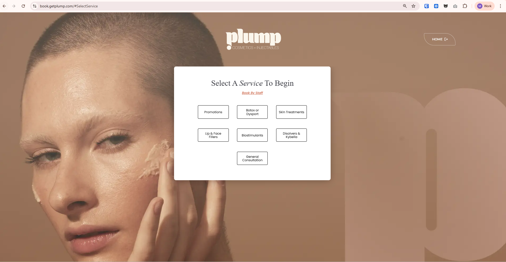
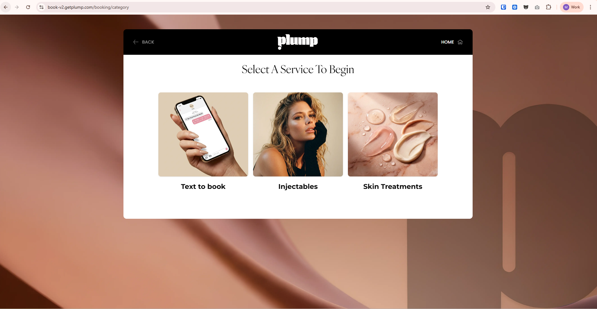
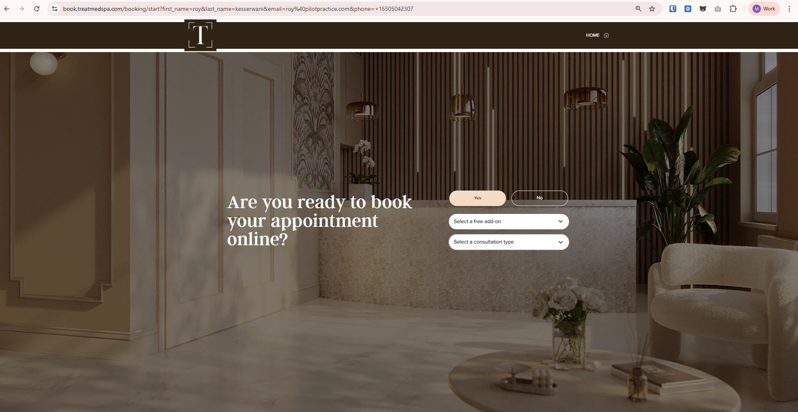

# Booking Flow - Boulevard Integration

## 1. Giới thiệu

Ứng dụng booking flow tích hợp với Boulevard Book SDK để quản lý đặt lịch dịch vụ (spa, salon, wellness).

**Boulevard SDK Documentation:**  
https://developers.joinblvd.com/getting-started/introduction

**Tech Stack:**
- React 19 + TypeScript 5
- Vite 7
- Tailwind CSS 4
- TanStack Query 5
- Zustand (State Management)
- Zod + React Hook Form
- Boulevard Book SDK v2.0.9

---

## 2. Projects đang sử dụng

Tùy theo nhu cầu của khách hàng sẽ có UI và flow khác nhau.

### 2.1 Getplump

**V1 (nhánh `main`):**  
https://book.getplump.com/



**V2 (nhánh `v2`):** 
https://book-v2.getplump.com/ => hiện tại đang dùng 


### 2.2 Treat

**Nhánh `booking-flow/treat`:**  
https://book.treatmedspa.com/


---

## 3. Development

**Dev Server:**
```bash
pnpm dev
```
Runs at: `http://localhost:4210`

**Environment Variables:**
```bash
VITE_BOULEVARD_API_KEY=         # Boulevard API key
VITE_BOULEVARD_BUSINESS_ID=     # Business ID
VITE_BOULEVARD_TARGET=sandbox   # sandbox | live
VITE_BOULEVARD_TIMEZONE=        # Optional timezone
VITE_API_BASE_URL=              # Lead API base URL (optional)
VITE_API_TOKEN=                 # Lead API token (optional)
```

---
