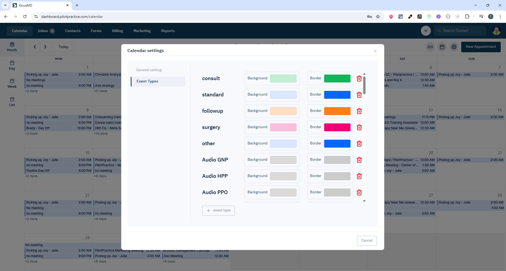
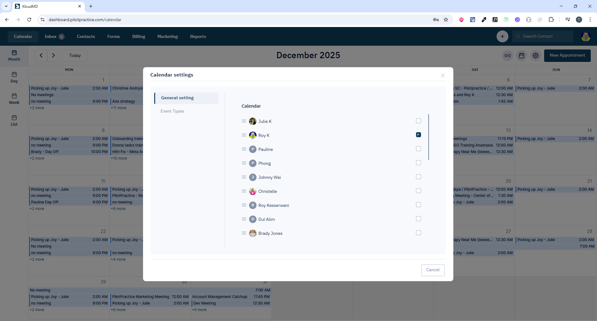

# Calendar Screen - Quản lý sự kiện và lịch làm việc

## 1. Giới thiệu

Màn hình Calendar cho phép quản lý events của team, bao gồm:

- Hiển thị events từ widget booking
- Sync events từ third-party integrations (Google Calendar, Outlook...)
- Tạo custom events
- Quản lý event types
- Filter theo location (nếu project bật multi-location)

**Routes:**

- `/calendar` - Trang chính calendar

**Scope:** Xem, tạo, sửa, xóa events. Hỗ trợ check-in/check-out cho appointments.

---

## 2. Yêu cầu chức năng

### 2.1 Hiển thị Events

- Show events có staff thuộc team đang config (từ Settings)
- Hiển thị events từ:
  - Widget booking appointments
  - Integration sync (Google Calendar, Outlook, Office365)
  - Custom events tạo thủ công
- Filter theo location (nếu `project.dashboard_location_filter === true`)
- Ẩn no_show events (`get_no_show: false` trong API params)




### 2.2 Tạo Event

- Click vào time slot → mở modal tạo event
- Chọn event type (custom hoặc từ danh sách có sẵn)
- Assign participants (leads, staffs)
- Set start_time, end_time, timezone
- Attach procedures/services (nếu có)
- Tạo meeting room (telehealth) nếu cần


### 2.3 Sửa/Xóa Event

- Click vào event → mở modal chi tiết
- Chỉnh sửa thông tin event
- Delete event (chỉ custom events, không xóa được sync events)
- Update status: `confirmed`, `pending`, `complete`, `cancelled`, `no_show`, `request`

### 2.4 Check-in/Check-out

- Check-in: Đánh dấu lead đã đến (`checked_in: timestamp`)
- Check-out: Đánh dấu lead đã rời đi (`checked_out: timestamp`)

### 2.5 Sync với Third-party

- Toggle sync cho từng calendar integration
- Auto refresh khi có event mới từ integration
- Display flag `source: 'third_party'` để phân biệt

---

## 3. API Endpoints

| Method | Endpoint                 | Mục đích                   | Params                                                | Response        |
| ------ | ------------------------ | -------------------------- | ----------------------------------------------------- | --------------- |
| GET    | `/api/events`            | Lấy danh sách events       | `start_time`, `end_time`, `location_id?`, `staff_id?` | `EventList`     |
| GET    | `/api/events/:id`        | Lấy chi tiết event         | `id` (string)                                         | `Event`         |
| POST   | `/api/events`            | Tạo event mới              | `EventRequestParams`                                  | `Event`         |
| PUT    | `/api/events/:id`        | Cập nhật event             | `id`, `EventRequestParams`                            | `Event`         |
| DELETE | `/api/events/:id`        | Xóa event                  | `id` (string)                                         | `Event`         |
| GET    | `/api/event-types`       | Lấy danh sách event types  | `location_id?`                                        | `EventType[]`   |
| POST   | `/api/event-types`       | Tạo event type mới         | `EventType`                                           | `EventType[]`   |
| PUT    | `/api/event-types/:id`   | Cập nhật event type        | `id`, `EventType`                                     | `EventType[]`   |
| DELETE | `/api/event-types/:id`   | Xóa event type             | `id`                                                  | `EventType[]`   |
| POST   | `/api/events/telehealth` | Tạo meeting room cho event | `eventId`                                             | `EventRoomType` |
| DELETE | `/api/event-rooms/:id`   | Xóa meeting room           | `id`                                                  | `unknown`       |
| PUT    | `/api/calendars/:id`     | Toggle sync calendar       | `id`, `sync: boolean`                                 | `Calendar`      |
| PUT    | `/api/calendars/bulk`    | Sắp xếp thứ tự calendars   | `calendar: [{id, order}]`                             | `Calendar`      |

### 3.1 EventRequestParams

```typescript
{
  title?: string;
  start_time?: number;          // Unix timestamp
  end_time?: number;            // Unix timestamp
  location_id?: number;
  type?: string;                // Event type
  status?: string;              // 'confirmed' | 'pending' | 'complete' | 'cancelled' | 'no_show' | 'request'
  participants?: Participant[]; // [{participable_type, participable_id}]
  description?: string;
  procedure_ids?: string[];     // Services attached
  procedure_addons?: string[];
  procedure_addon_ids?: string[];
  isStaffMeeting?: boolean;     // Internal staff meeting
  timezone?: string;
  checked_in?: number;          // Timestamp
  checked_out?: number;         // Timestamp
  event_room_id?: number;       // Telehealth room
  notify_participants?: boolean;
}
```

---

## 4. WebSocket Events

| Event Type      | Trigger             | Action                                               |
| --------------- | ------------------- | ---------------------------------------------------- |
| `NEW_EVENT`     | Event mới được tạo  | Invalidate query `['fetchEvents']`, refresh calendar |
| `EVENT_UPDATED` | Event được cập nhật | Invalidate query `['fetchEvents']`, refresh calendar |
| `EVENT_DELETED` | Event bị xóa        | Invalidate query `['fetchEvents']`, refresh calendar |

---

## 5. Redux State

### 5.1 Calendar State

- `eventsCalendar.roomUrl` - Meeting room URL cho event
- `eventsCalendar.events` - Danh sách events hiện tại

### 5.2 Actions

- `clearRoomCalendar()` - Clear meeting room khi leave

---

## 6. Lưu ý kỹ thuật

### 6.1 Filter Logic

- **Location Filter:** Chỉ hiện nếu `project.dashboard_location_filter === true`
- **Team Filter:** Events chỉ show nếu có staff thuộc team config trong Settings
- **Source Priority:** Events từ integration sync (`source: 'third_party'`) được ưu tiên display

### 6.2 Auto Refresh

- WebSocket real-time updates khi có event mới/sửa/xóa

### 6.3 Timezone Handling

- Lưu `timezone` trong event
- Convert timestamp theo timezone của user khi display
- Default timezone: `project.timezone`

### 6.4 Event Colors

- Mỗi event type có `backgroundColor` và `borderColor` riêng
- Custom events: màu default từ theme
- Integration events: màu theo calendar source

### 6.5 Permissions

- Staff role `staff` không thể xóa events
- Chỉ owner hoặc admin mới có thể delete/edit events
- Integration sync events: read-only, không edit được

---

## 7. Component Structure

```
pages/apps/calendar.tsx
└── containers/apps/calendar/
    ├── wrapper/
    ├── sidebar/          # Mini calendar, event list
    └── main/
        ├── calendar-header/
        └── FullCalendar component
            ├── dayGridPlugin
            ├── timeGridPlugin
            ├── interactionPlugin
            └── resourceTimelinePlugin
```

---

## 8. Dependencies

- `@fullcalendar/react` - Calendar UI
- `@fullcalendar/daygrid` - Month view
- `@fullcalendar/timegrid` - Week/Day view
- `@fullcalendar/interaction` - Click/drag interactions
- `@tanstack/react-query` - Data fetching

---
