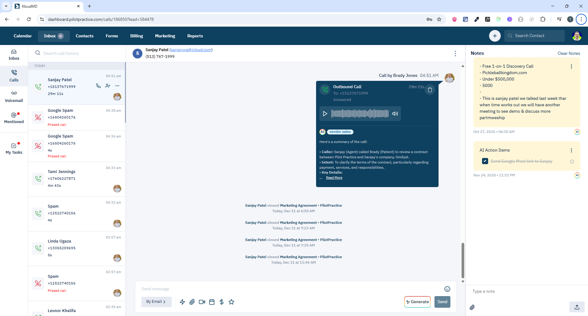

# Calls Screen - Quản lý cuộc gọi


## 1. Giới thiệu
Màn hình Calls quản lý tất cả cuộc gọi voice (inbound/outbound) qua Twilio integration.

**Routes:**
- `/calls` - Danh sách tất cả cuộc gọi
- `/calls/:id` - Chi tiết cuộc gọi cụ thể

**Scope:** Xem lịch sử cuộc gọi, nghe recording, gọi điện, xem chi tiết lead, tạo meeting room.

---

## 2. Yêu cầu chức năng

### 2.1 Hiển thị Calls
- Danh sách cuộc gọi với thông tin:
  - Direction: `inbound` | `outbound`
  - Status: `initiated`, `completed`, `busy`, `no-answer`, `voicemail`, `failed`, `cancelled`
  - From/To phone numbers
  - Duration (giây)
  - Recording URL
  - Lead information
  - Timestamp
- Pagination
- Search theo keyword (phone number, lead name)
- Filter voicemails: `get_voicemail=true`

### 2.2 Chi tiết Call
- Thông tin cuộc gọi đầy đủ
- Play recording (nếu có)
- Lead details sidebar
- Messages history với lead
- Tạo ticket từ call
- Tạo meeting room

### 2.3 Gọi điện
- Outbound call qua Twilio Device
- Incoming call notification
- Active call controls:
  - Mute/Unmute
  - Hold/Unhold
  - Hangup
  - Transfer (nếu có)
- Call duration timer

### 2.4 Voicemail
- Lọc calls có status `voicemail`
- Play voicemail recording
- Mark as listened
- Delete voicemail

---

## 3. API Endpoints

| Method | Endpoint | Mục đích | Params | Response |
|--------|----------|----------|--------|----------|
| GET | `/api/calls` | Lấy danh sách calls | `page`, `keyword?`, `get_voicemail?` | `CommonPagination<Call>` |
| GET | `/api/calls/:id` | Lấy chi tiết call | `id` | `Call` |
| POST | `/api/calls` | Tạo call record | `CreateCallForm` | `Call` |
| PUT | `/api/calls/:id` | Cập nhật call | `id`, `UpdateCallForm` | `Call` |
| DELETE | `/api/calls/:id` | Xóa call | `id` | `Call` |
| GET | `/api/calls/get-active-call/:leadId` | Lấy active call của lead | `leadId` | `DailyRoomResponse` |
| POST | `/api/webhook/dailyco/meeting-ended` | End meeting/call | `call_id`, `status?` | `unknown` |

### 3.1 CreateCallForm
```typescript
{
  call_sid?: string;              // Twilio Call SID
  form_id?: number;               // Form ID (nếu call từ form)
  from_phone_number?: string;     // Số gọi đi
  to_phone_number: string;        // Số nhận (required)
  location?: string;              // Location
  recording?: string;             // Recording URL
  duration?: number;              // Duration in seconds
  status: "initiated" | "completed" | "busy" | "no-answer";
  lead_id: number;                // Lead ID (required)
  direction: "inbound" | "outbound"; // Direction (required)
}
```

### 3.2 UpdateCallForm
```typescript
{
  call_sid?: string;
  form_id?: number;
  from_phone_number?: string;
  to_phone_number?: string;
  location?: string;
  recording?: string;
  duration?: number;
  status?: "initiated" | "completed" | "busy" | "no-answer" | "voicemail" | "failed" | "cancelled";
  lead_id?: number;
  direction?: "inbound" | "outbound";
  listened?: boolean;             // Mark voicemail as listened
}
```

---

## 4. WebSocket Events

| Event Type | Trigger | Action |
|------------|---------|--------|
| `NEW_MESSAGE` | Tin nhắn mới từ lead trong call | Invalidate `['messages', leadId]` |
| `MESSAGE_UPDATED` | Tin nhắn được cập nhật | Invalidate `['messages', leadId]` |
| `CALL_UPDATED` | Call status thay đổi | Invalidate `['getDataCalls']`, refresh UI |

---

## 5. Redux State

### 5.1 Call State
- `call.device` - Twilio Device instance
- `call.currentCall` - Current active call
- `call.callStatus` - Call status (Call.State.Open, etc.)
- `call.call_id` - Current call ID
- `call.callPage` - Current page number
- `call.calleNumber` - Số điện thoại đang gọi
- `call.dialerNumber` - Số điện thoại nhận
- `call.isCallPage` - Flag đang ở trang calls

### 5.2 Actions
- `onCallRegistered()` - Register incoming call
- `onCalleNumberChange()` - Change caller number
- `onDurationChange()` - Update call duration
- `onSetCallPage()` - Set page number

---

## 6. Lưu ý kỹ thuật

### 6.1 Twilio Integration
- Twilio Device SDK để handle calls
- Device events:
  ```javascript
  twilioDevice.on('incoming', (incoming_call) => {
    // Handle incoming call
  });
  
  twilioDevice.on('error', (error) => {
    // Handle error
  });
  ```

### 6.2 Call Duration Timer
- Update mỗi 1 giây khi call đang active
- Use `useInterval` hook:
  ```javascript
  useInterval(
    () => {
      dispatch(onDurationChange({ duration: Date.now() }));
    },
    callStatus === Call.State.Open ? 1000 : null
  );
  ```

### 6.3 Prevent Page Refresh During Call
```javascript
const preventRefresh = (event) => {
  if (currentCall) {
    event.preventDefault();
    return 'You currently on a call, reloading the page would end the call.';
  }
};
```

### 6.4 Active Call Component
- Hiển thị ở bottom-right mọi trang (trừ invalid routes)
- Position: `bottom: 2rem`
- Sticky component, không bị ẩn khi navigate

### 6.5 Voicemail Filter
- Param: `get_voicemail=true`
- Chỉ lấy calls có `status === 'voicemail'`
- Mark as listened: `PUT /api/calls/:id` với `listened: true`

---

## 7. Component Structure

```
pages/apps/calls.tsx
└── containers/apps/
    ├── ticket/sidebar/       # Shared sidebar
    ├── calls/
    │   ├── group/            # Call list
    │   └── main/             # Call detail & lead info
    └── components/call/
        ├── ActiveCall/       # Active call widget
        └── IncomingCall/     # Incoming call notification
```

---

## 8. Dependencies
- `@twilio/voice-sdk` - Twilio Voice SDK
- `react-query` - Data fetching
- `usehooks-ts` - useInterval hook
- `react-toastify` - Notifications

---

## 9. Call Flow

### 9.1 Outbound Call
1. User nhập số điện thoại hoặc click call từ lead
2. `onCalleNumberChange()` set số điện thoại
3. Twilio Device initiate call
4. `POST /api/calls` tạo call record
5. Call status updates: `initiated` → `completed`/`busy`/`no-answer`
6. Recording saved (nếu có)

### 9.2 Inbound Call
1. Twilio webhook trigger incoming call
2. `twilioDevice.on('incoming')` event
3. `onCallRegistered()` register call
4. Show IncomingCall component
5. User accept/reject
6. `POST /api/calls` tạo call record
7. Call status updates

---

## 10. Permissions
- **All roles:** Có thể gọi điện, xem calls
- **Staff:** Chỉ xem calls của mình
- **Admin/Owner:** Xem tất cả calls

---

