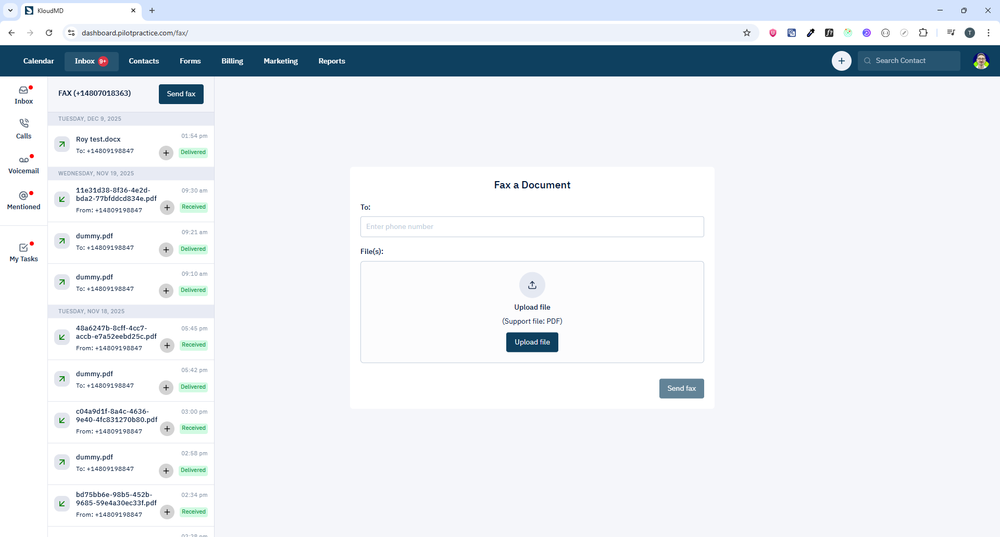

# Fax Screen - Quản lý fax


## 1. Giới thiệu
Màn hình Fax quản lý gửi/nhận fax qua Twilio Programmable Fax.

**Routes:**
- `/fax` - Danh sách tất cả fax messages
- `/fax/:id` - Chi tiết fax message cụ thể

**Scope:** Xem, gửi, nhận fax, quản lý fax phone numbers.

---

## 2. Yêu cầu chức năng

### 2.1 Hiển thị Fax Messages
- Danh sách fax messages (inbound/outbound)
- Thông tin hiển thị:
  - Direction: `inbound` | `outbound`
  - From/To fax number
  - Lead information
  - Status: `sent`, `delivered`, `failed`, `received`
  - Number of pages
  - Media URL (PDF)
  - Timestamp
- Pagination
- Search theo keyword

### 2.2 Chi tiết Fax
- View fax PDF
- Download fax
- Lead details
- Attach to lead (nếu chưa có)
- Resend fax (nếu failed)

### 2.3 Gửi Fax
- Upload PDF/image file
- Enter recipient fax number
- Select from fax number (channel)
- Send fax
- Track delivery status

### 2.4 Quản lý Fax Numbers
- Danh sách fax phone numbers
- Purchase new fax number
- Search available numbers by:
  - Country code
  - Area code
  - Locality
- Delete fax number

---

## 3. API Endpoints

| Method | Endpoint | Mục đích | Params | Response |
|--------|----------|----------|--------|----------|
| GET | `/api/fax-messages` | Lấy danh sách fax messages | `limit?`, `page?` | `CommonPagination<Message>` |
| GET | `/api/fax-channels` | Lấy danh sách fax numbers | `limit?`, `page?` | `CommonPagination<Fax>` |
| GET | `/api/phone-numbers/fax/available` | Search available fax numbers | `country_code`, `area_code` | `AvailablePhone[]` |
| POST | `/api/phone-number/purchase` | Purchase fax number | `phone_number` | `unknown` |
| POST | `/api/send-fax` | Gửi fax | `FormData` (file + recipient) | `unknown` |
| PUT | `/api/fax-messages/message/:id/lead/:leadId/attach` | Attach fax to lead | `id`, `lead_id` | `unknown` |

### 3.1 Send Fax Params
```typescript
FormData {
  file: File;              // PDF or image file
  to: string;              // Recipient fax number (E.164 format)
  from: string;            // Sender fax number (from fax channels)
  lead_id?: number;        // Optional lead ID
}
```

### 3.2 Purchase Fax Number
```typescript
{
  phone_number: string;    // E.164 format: +1234567890
}
```

### 3.3 Search Available Numbers
```typescript
{
  country_code: string;    // e.g., "US", "CA"
  area_code: string;       // e.g., "415", "212"
}

Response: AvailablePhone[] {
  phone_number: string;
  locality: string;        // City name
}
```

---

## 4. WebSocket Events

| Event Type | Trigger | Action |
|------------|---------|--------|
| `NEW_FAX` | Fax mới nhận được | Invalidate fax messages query, show notification |
| `FAX_STATUS_UPDATED` | Fax status thay đổi | Update delivery status, refresh UI |

---

## 5. Lưu ý kỹ thuật

### 5.1 File Upload
- Support formats: PDF, JPEG, PNG, TIFF
- Max file size: 10MB (check Twilio limits)
- Convert images to PDF trước khi send (nếu cần)
- Preview file trước khi send

### 5.2 Phone Number Format
- Use E.164 format: `+[country code][number]`
- Example: `+14155551234`
- Validate format trước khi send/purchase

### 5.3 Fax Delivery Status
- **Queued:** Fax đang chờ gửi
- **Sending:** Đang gửi
- **Delivered:** Gửi thành công
- **Failed:** Gửi thất bại (busy, no-answer, error)
- **Received:** Nhận fax thành công

### 5.4 Attach to Lead
- Fax inbound có thể chưa có lead
- Manual attach fax to lead:
  ```
  PUT /api/fax-messages/message/:id/lead/:leadId/attach
  ```
- Auto-match lead by phone number (nếu có)

### 5.5 Fax Channels
- Mỗi fax number là 1 channel
- Purchase number → tạo fax channel
- Delete channel → release number (charge may apply)

---

## 6. Component Structure

```
pages/apps/faxes.tsx
└── containers/apps/
    ├── ticket/
    │   ├── sidebar/          # Sidebar
    │   └── fax/              # Fax list group
    └── fax/                  # Fax detail & send form
```

---

## 7. Fax Workflow

### 7.1 Send Fax
1. User upload PDF/image file
2. Select from fax number (channel)
3. Enter recipient fax number
4. Optional: select lead
5. Click Send
6. `POST /api/send-fax` với FormData
7. Track delivery status via webhook/polling

### 7.2 Receive Fax
1. Twilio webhook trigger khi nhận fax
2. Backend tạo fax message record
3. WebSocket notify frontend
4. Show notification
5. User view/download fax
6. Attach to lead (manual hoặc auto-match)

### 7.3 Purchase Fax Number
1. User search available numbers
2. `GET /api/phone-numbers/fax/available`
3. Select number from list
4. `POST /api/phone-number/purchase`
5. Number added to fax channels
6. Ready to send/receive fax

---

## 8. Permissions
- **All roles:** Có thể gửi/nhận fax
- **Admin/Owner:** Purchase/delete fax numbers

---

