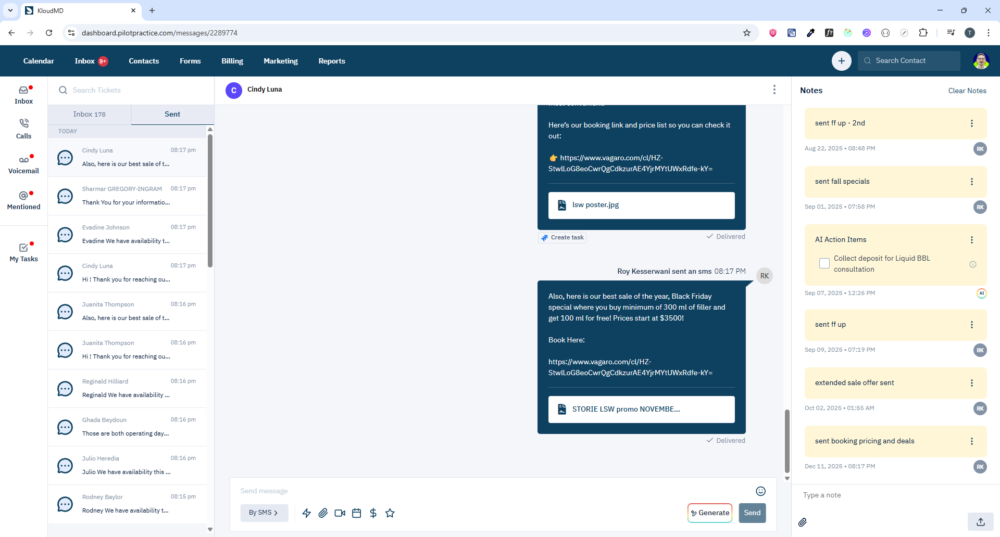

# Messages Screen - Quản lý tin nhắn tập trung


## 1. Giới thiệu
Màn hình Messages là inbox tập trung cho tất cả tin nhắn từ các kênh (SMS, Email, Facebook, Instagram, Chat Widget...).

**Routes:**
- `/messages` - Danh sách tất cả conversations
- `/messages/:id` - Chi tiết conversation cụ thể

**Scope:** Xem, gửi, trả lời tin nhắn qua nhiều kênh, quản lý conversations.

---

## 2. Yêu cầu chức năng

### 2.1 Hiển thị Messages
- Danh sách conversations theo lead
- Group theo kênh:
  - SMS
  - Email (với threading)
  - Facebook Messenger
  - Instagram DM
  - Chat Widget
  - WhatsApp (nếu có)
- Filter theo:
  - Type: `sms`, `email`, `facebook`, `instagram`, `chat`
  - Read/Unread
  - Has attachments
- Search theo keyword
- Pagination

### 2.2 Chi tiết Conversation
- Thread messages theo thời gian
- Hiển thị:
  - Message content (text/html)
  - Attachments (images, files, videos)
  - Sender info (lead/staff)
  - Timestamp
  - Read status
  - Delivery status (sent/delivered/failed)
- Email threading (group emails theo subject/thread_id)
- Real-time updates qua WebSocket

### 2.3 Gửi Tin nhắn
- **SMS:**
  - Gửi text message
  - Attach images/files
  - Character count (160 chars/segment)
- **Email:**
  - Rich text editor (HTML)
  - Subject line
  - CC/BCC
  - Attachments
  - Reply/Forward
  - Email threading
- **Social (FB/IG):**
  - Text message
  - Images/GIFs
  - Quick replies
- **Chat Widget:**
  - Text message
  - Attachments
  - Typing indicator

### 2.4 Advanced Features
- **AI Reply:** Generate reply bằng AI (`by_ai: true`)
- **Templates:** Use message templates
- **Mentions:** @mention staff trong internal notes
- **Attachments:** Upload files (images, documents, videos)
- **Threading:** Email threading theo `thread_id`

---

## 3. API Endpoints

| Method | Endpoint | Mục đích | Params | Response |
|--------|----------|----------|--------|----------|
| GET | `/api/messages` | Lấy danh sách messages | `lead_id?`, `type?`, `has?`, `with?`, `limit?`, `page?`, `in[messageable_type]?` | `CommonPagination<Message>` |
| GET | `/api/messages/:id` | Lấy chi tiết message | `id` | `Message` |
| POST | `/api/messages` | Gửi message mới | `SendMessageParams` | `Message` |
| DELETE | `/api/messages/:id` | Xóa message | `id` | `Message` |
| POST | `/api/send-link-message` | Gửi link download mobile app | `to_number` | `unknown` |

### 3.1 SendMessageParams
```typescript
{
  message: string | null;         // Message content
  channel_id: number;             // Channel ID (required)
  to: 
    | { fb_id?: string; insta_id?: string }  // For social
    | { lead_id?: number; email?: string; phone?: string }[];  // For SMS/Email
  
  // Email specific
  email_message?: {
    html: string | null;          // HTML content
    subject: string;              // Email subject
    cc?: { lead_id?: number; email?: string }[];
    bcc?: { lead_id?: number; email?: string }[];
    thread_id?: number;           // For threading
  };
  
  // SMS specific
  sms_message?: {
    to: { lead_id?: number; phone?: string }[];
  };
  
  reply_to?: number;              // Reply to message ID
  attachments?: number[];         // File IDs
  by_ai?: boolean;                // AI generated reply
}
```

### 3.2 GetMessagesParams
```typescript
{
  lead_id?: number;               // Filter by lead
  type?: string;                  // 'sms' | 'email' | 'facebook' | 'instagram'
  has?: string;                   // 'attachments' | 'unread'
  with?: string;                  // Include relations
  limit?: number;
  page?: number;
  "in[messageable_type]"?: string; // Filter by messageable type
}
```

---

## 4. WebSocket Events

| Event Type | Trigger | Action |
|------------|---------|--------|
| `NEW_MESSAGE` | Tin nhắn mới | Invalidate `['messages', leadId]`, show notification, update unread count |
| `MESSAGE_UPDATED` | Tin nhắn được cập nhật | Invalidate `['messages', leadId]`, refresh UI |
| `MESSAGE_DELETED` | Tin nhắn bị xóa | Invalidate `['messages', leadId]`, remove from UI |
| `TYPING` | Lead đang typing | Show typing indicator |

---

## 5. Redux State

### 5.1 Message State
- `lead.message.showMessageModal` - Show/hide compose modal
- `lead.message.isGlobalPopup` - Global compose popup
- `lead.message.isOpenEmailFormGlobal` - Email form state
- `lead.message.isOpenSmsFormGlobal` - SMS form state

### 5.2 Actions
- `doSetShowMessageModal()` - Toggle message modal
- `doSetOpenEmailForm()` - Open email form
- `doSetOpenSmsForm()` - Open SMS form
- `doSetGlobalPopUp()` - Toggle global popup

---

## 6. Lưu ý kỹ thuật

### 6.1 Email Threading
- Group emails theo `thread_id`
- Display như conversation thread
- Reply sẽ có cùng `thread_id`
- Subject line format: `Re: Original Subject`

### 6.2 SMS Character Count
- 160 characters = 1 segment
- Special characters count as 2
- Show character count và segment count
- Warning khi > 3 segments

### 6.3 Attachments
- Upload files trước khi send message
- Get file IDs từ upload response
- Pass file IDs trong `attachments` array
- Support: images, documents, videos

### 6.4 AI Reply
- Set `by_ai: true` trong params
- Backend generate reply dựa trên conversation context
- Show "AI Generated" badge
- Allow edit trước khi send

### 6.5 Real-time Updates
- WebSocket connection cho real-time messages
- Typing indicator
- Read receipts
- Delivery status updates

### 6.6 Channel Detection
- Auto-detect channel từ `channel_id`
- Different UI cho mỗi channel type
- Email: Rich text editor
- SMS: Plain text với character count
- Social: Quick replies, GIFs

---

## 7. Component Structure

```
pages/apps/messages.tsx
└── containers/apps/ticket/
    ├── wrapper/
    ├── sidebar/              # Conversation list
    ├── message/
    │   ├── index.tsx         # Message group/filter
    │   └── main-message/     # Message thread
    └── chat-form/            # Compose message form
```

---

## 8. Message Types

### 8.1 SMS
- Plain text
- Max 1600 characters (10 segments)
- Attachments: images only
- No formatting

### 8.2 Email
- HTML content
- Rich text editor
- Subject, CC, BCC
- Attachments: any file type
- Threading support

### 8.3 Facebook/Instagram
- Text message
- Images, GIFs
- Quick replies
- Reactions (nếu support)

### 8.4 Chat Widget
- Text message
- Attachments
- Typing indicator
- Read receipts

---

## 9. Permissions
- **All roles:** Có thể gửi/nhận messages
- **Staff:** Chỉ xem messages của leads được assign
- **Admin/Owner:** Xem tất cả messages

---

