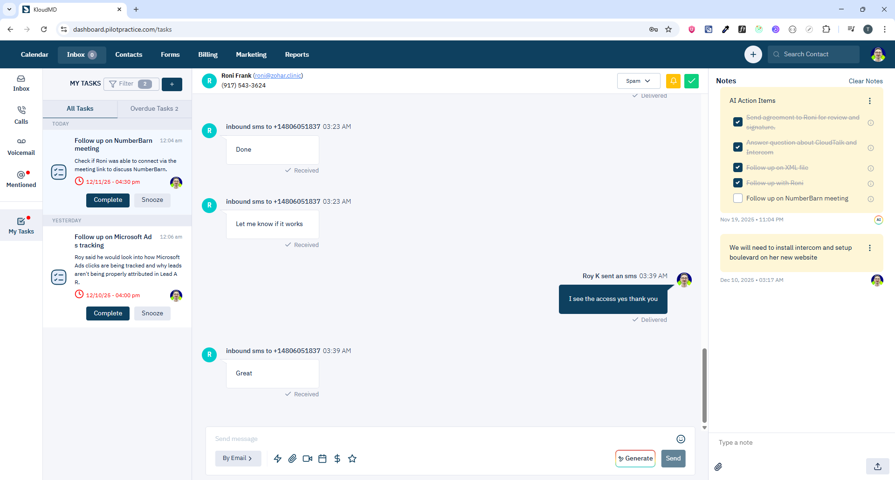

# Tasks, Reports, Marketing & Other Modules

## 1. Tasks Module


### 1.1 Giới thiệu
Quản lý tasks/to-dos cho team.

**Routes:**
- `/tasks` - Danh sách tasks
- `/tasks/:id` - Chi tiết task

### 1.2 Yêu cầu chức năng
- **CRUD Tasks:**
  - Create task
  - Update task
  - Delete task (single/bulk)
  - Mark as complete
- **Task Properties:**
  - Title (`name`)
  - Description
  - Assigned to (`staff_id`)
  - Related to lead (`lead_id`)
  - Due date (`reminder_date` - unix timestamp)
  - Has reminder (`has_reminder: boolean`)
  - Status: `open`, `complete`, `delete`
  - Is past due (calculated field)
- **Filters:**
  - Status filter
  - Staff filter
  - Lead filter
  - Date range filter
  - Has reminder
  - Is past due
  - Soonest reminder

### 1.3 API Endpoints
| Method | Endpoint | Mục đích | Params |
|--------|----------|----------|--------|
| GET | `/api/tasks` | Lấy danh sách tasks | `page?`, `limit?`, `staff_id?`, `status?`, `lead_id?`, `created_from?`, `created_to?`, `has_reminder?`, `is_past_due?`, `is_soonest_reminder?` |
| POST | `/api/tasks` | Tạo task | `CreateTaskRequestParams` |
| PUT | `/api/tasks/:id` | Cập nhật task | `id`, `UpdateTaskForm` |
| DELETE | `/api/tasks/:id` | Xóa task | `id` |
| PUT | `/api/tasks/bulk` | Bulk update | `ids[]`, `status: 'complete' \| 'delete'` |
| DELETE | `/api/tasks/bulk` | Bulk delete | `ids[]` |
| GET | `/api/tasks/status/count` | Lấy task counts | Same filters as GET /api/tasks |

### 1.4 Task Status (TaskStatus)
```typescript
type TaskStatus = "open" | "complete" | "delete" | string;
```

### 1.5 Task Counts
```typescript
interface CountOfTask {
  open: number;
  complete: number;
  overdue: number;
}
```

### 1.6 CreateTaskRequestParams
```typescript
{
  name?: string;
  status?: TaskStatus;
  has_reminder?: boolean;
  lead_id?: number;
  staff_id?: number;
  description?: string;
  reminder_date?: number;      // Unix timestamp
}
```

### 1.7 Component Structure
```
pages/apps/tasks.tsx
└── containers/apps/ticket/task/
    ├── main/                 # Tasks list
    └── (shared with ticket module)
```

**Lưu ý:** Tasks sử dụng chung components với Ticket module.

---

## 2. Reports Module

### 2.1 Giới thiệu
Analytics và reporting dashboard.


**Route:** `/reports`

### 2.2 Yêu cầu chức năng
- **Dashboard Overview:**
  - Key metrics (tickets, leads, revenue)
  - Charts (line, bar, pie)
  - Date range filter
- **Report Types:**
  - **Tickets Report:**
    - Total tickets
    - Tickets by status
    - Tickets by type
    - Response time
    - Resolution time
  - **Leads Report:**
    - New leads
    - Lead sources
    - Conversion rate
  - **Revenue Report:**
    - Total revenue
    - Revenue by service
    - Revenue by location
  - **Communication Report:**
    - SMS sent/received
    - Emails sent/received
    - Calls made/received
    - Average call duration
  - **Staff Performance:**
    - Tickets handled
    - Average response time
    - Customer satisfaction

### 2.3 API Endpoints
| Method | Endpoint | Mục đích |
|--------|----------|----------|
| GET | `/api/reports/tickets` | Tickets analytics |
| GET | `/api/reports/leads` | Leads analytics |
| GET | `/api/reports/revenue` | Revenue analytics |
| GET | `/api/reports/communication` | Communication analytics |
| GET | `/api/reports/staff` | Staff performance |

### 2.4 Export Reports
- Export to CSV
- Export to PDF
- Schedule email reports (daily/weekly/monthly)

---

## 3. Marketing Module

### 3.1 Giới thiệu
Marketing campaigns và email/SMS broadcasts.


**Route:** `/marketing`

### 3.2 Yêu cầu chức năng
- **Campaigns:**
  - Create campaign
  - Email broadcast
  - SMS broadcast
  - Target audience (segments)
- **Email Builder:**
  - Drag-drop email builder
  - Templates
  - Personalization (merge tags)
  - Preview
- **SMS Campaigns:**
  - Bulk SMS
  - Character count
  - Opt-out handling
- **Campaign Analytics:**
  - Sent count
  - Open rate (email)
  - Click rate
  - Unsubscribe rate
  - Conversion tracking

### 3.3 API Endpoints
| Method | Endpoint | Mục đích |
|--------|----------|----------|
| GET | `/api/campaigns` | Lấy campaigns |
| POST | `/api/campaigns` | Tạo campaign |
| POST | `/api/campaigns/:id/send` | Send campaign |
| GET | `/api/campaigns/:id/analytics` | Campaign analytics |

---

## 4. Dialer Module

### 4.1 Giới thiệu
Power dialer cho outbound calling.

**Route:** `/dialer`

### 4.2 Yêu cầu chức năng
- **Dialer Interface:**
  - Keypad
  - Call queue
  - Auto-dial next number
  - Call scripts
- **Call Queue:**
  - Load leads to call
  - Skip/Next
  - Mark outcome (answered/voicemail/busy/no-answer)
- **Call Recording:**
  - Record calls
  - Play recordings
  - Download recordings

---

## 5. Mentions Module


### 5.1 Giới thiệu
Quản lý @mentions trong tickets/messages.

**Route:** `/mentions`

### 5.2 Yêu cầu chức năng
- **Mentions List:**
  - All mentions của user
  - Unread mentions
  - Mark as read
- **Mention Notification:**
  - Real-time notification khi được mention
  - Email notification
  - Badge count

---

## 6. Client Portal Module

### 6.1 Giới thiệu
Portal cho clients để view/manage thông tin của họ.

**Routes:**
- `/client-portal` - Portal dashboard (internal)
- `/client/portal/:uuidProject` - Client portal (public)

### 6.2 Yêu cầu chức năng
- **Client Login:**
  - Email/password login
  - Magic link login
- **Portal Features:**
  - View appointments
  - View invoices
  - Pay invoices
  - Fill forms
  - Upload files
  - View messages
  - Request appointment

---

## 7. Telehealth & Meeting Modules

### 7.1 Telehealth
**Route:** `/telehealth/:textId`

- Video call với lead (Daily.co integration)
- Screen share
- Chat
- Recording

### 7.2 Meeting
**Route:** `/meeting/:textId`

- Internal staff meetings
- Video conference
- Screen share
- Recording

---

## 8. File Request Upload Module

### 8.1 Giới thiệu
Public file upload page cho leads.

**Route:** `/file-request-upload/:accessToken`

### 8.2 Yêu cầu chức năng
- **File Upload:**
  - Drag-drop upload
  - Multiple files
  - Progress bar
- **Access Control:**
  - Token-based access
  - Expiration time
  - One-time use (optional)

---

## 9. Authentication & Onboarding Modules

### 9.1 Routes
- `/login` - Sign in
- `/signup` - Sign up (commented out, không có route)
- `/invite/:token` - Invitation sign up
- `/verify-account` - Email verification
- `/forgot-password` - Forgot password
- `/reset-password/:token` - Reset password
- `/reset-password-onboarding` - Reset password sau onboarding
- `/onboarding/:uuid?` - Client onboarding
- `/onboarding/admin/:uuid` - Admin onboarding

### 9.2 Onboarding Flow
- **Client Onboarding:**
  - Business info
  - Location setup
  - Phone number selection
  - Email connection (Gmail/Outlook)
  - Provider selection
- **Admin Onboarding:**
  - Admin-specific setup
  - Team setup
  - Initial configuration

---

## 10. Error Pages

### 10.1 Routes
- `/error-500` - Internal Server Error
- `/error-503` - Service Unavailable
- `/error-505` - HTTP Version Not Supported
- `*` (404) - Not Found

---

## 11. Other Routes

### 11.1 Introduce
**Route:** `/introduce`

- Landing page cho mobile users
- Redirect to mobile app hoặc show message

### 11.2 Rate Us
**Route:** `/rate-us`

- Review/rating modal
- Collect feedback

### 11.3 Callbacks
**Route:** `/callbacks/:provider`

- OAuth callbacks (Google, Outlook, Facebook, etc.)
- Integration callbacks (Jira, Slack, Zapier)

---