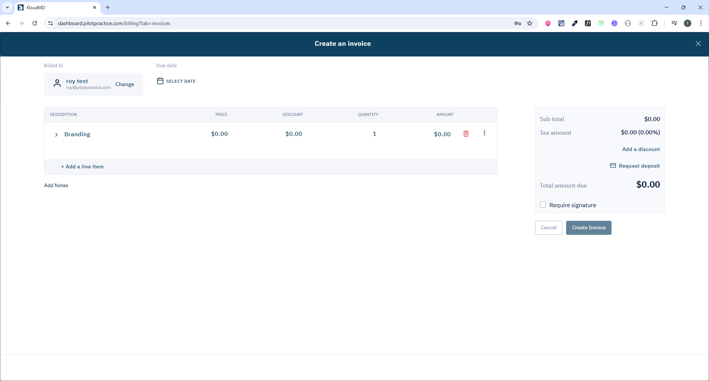

# Payment & Billing Module

## 1. Giới thiệu
Module Payment quản lý thanh toán, invoices, payment methods cho cả internal billing và client payments.

**Routes:**
- `/billing` - Billing dashboard (subscription billing)
- `/billing/invoice/:invoiceId` - Chi tiết invoice
- `/invoice/view/:id` - Public invoice view (không cần login)

**Scope:** Xem invoices, payment history, payment methods, process payments, send invoices.

---


## 2. Yêu cầu chức năng

### 2.1 Billing Dashboard
- **Subscription Billing:**
  - Current plan info
  - Next billing date
  - Payment method
  - Billing history
- **Usage Metrics:**
  - Contacts count
  - SMS usage
  - Storage usage
  - Additional features

### 2.2 Invoices Management
- **Invoice List:**
  - All invoices (paid/unpaid/overdue)
  - Filter by: status, date range
  - Search by invoice number
- **Invoice Details:**
  - Invoice number
  - Date, due date
  - Line items
  - Subtotal, tax, total
  - Payment status
  - Download PDF
- **Create Invoice:**
  - Add line items
  - Set due date
  - Add notes
  - Send to client
  
  

### 2.3 Payment Methods
- **Manage Payment Methods:**
  - Add credit card (Stripe)
  - Set default payment method
  - Delete payment method
- **Payment Processing:**
  - Process payment for invoice
  - Refund payment
  - Payment receipts

### 2.4 Client Payments
- **Send Invoice to Client:**
  - Email invoice link
  - SMS invoice link
  - Public payment page
- **Payment Page:**
  - View invoice details
  - Enter payment info
  - Process payment (Stripe)
  - Payment confirmation

---

## 3. API Endpoints

| Method | Endpoint | Mục đích | Params | Response |
|--------|----------|----------|--------|----------|
| GET | `/api/invoices` | Lấy danh sách invoices | `page?`, `limit?`, `status?`, `date_from?`, `date_to?` | `CommonPagination<Invoice>` |
| GET | `/api/invoices/:id` | Chi tiết invoice | `id` | `Invoice` |
| POST | `/api/invoices` | Tạo invoice | `InvoiceData` | `Invoice` |
| PUT | `/api/invoices/:id` | Cập nhật invoice | `id`, `InvoiceData` | `Invoice` |
| DELETE | `/api/invoices/:id` | Xóa invoice | `id` | `Invoice` |
| POST | `/api/invoices/:id/send` | Gửi invoice cho client | `id`, `method`, `to` | `unknown` |
| POST | `/api/invoices/:id/pay` | Process payment | `id`, `payment_method_id` | `Payment` |
| POST | `/api/payments/:id/refund` | Refund payment | `id`, `amount?` | `Payment` |
| GET | `/api/payment-methods` | Lấy payment methods | - | `PaymentMethod[]` |
| POST | `/api/payment-methods` | Add payment method | `stripe_token` | `PaymentMethod` |
| DELETE | `/api/payment-methods/:id` | Delete payment method | `id` | `PaymentMethod` |
| PUT | `/api/payment-methods/:id/default` | Set default | `id` | `PaymentMethod` |

### 3.1 InvoiceData
```typescript
{
  lead_id: number;
  invoice_number?: string;        // Auto-generated nếu không có
  date: Date;
  due_date: Date;
  status: 'draft' | 'sent' | 'paid' | 'overdue' | 'cancelled';
  line_items: InvoiceLineItem[];
  notes?: string;
  tax_rate?: number;              // Percentage (e.g., 8.5)
  discount?: number;              // Amount or percentage
}
```

### 3.2 InvoiceLineItem
```typescript
{
  description: string;
  quantity: number;
  unit_price: number;
  amount: number;                 // quantity * unit_price
  procedure_id?: number;          // Link to service/procedure
}
```

### 3.3 Payment Processing
```typescript
POST /api/invoices/:id/pay
{
  payment_method_id: string;      // Stripe payment method ID
  amount?: number;                // Partial payment (optional)
}
```

---

## 4. Lưu ý kỹ thuật

### 4.1 Stripe Integration
- Use Stripe Elements cho payment form
- Tokenize card info trước khi send to backend
- Backend create PaymentIntent
- Handle 3D Secure (SCA)
- Webhook cho payment status updates

### 4.2 Invoice Calculations
```typescript
subtotal = sum(line_items.amount)
tax = subtotal * (tax_rate / 100)
discount_amount = discount (nếu là amount) hoặc subtotal * (discount / 100)
total = subtotal + tax - discount_amount
```

### 4.3 Invoice Numbering
- Auto-generate: `INV-{year}-{sequential_number}`
- Example: `INV-2024-00123`
- Unique per project

### 4.4 Invoice Status
- Invoice `status` field là **string** (không có enum cố định)
- Có thể là custom status do user define
- Common values: `draft`, `sent`, `paid`, `overdue`, `cancelled`, `partial`
- Hệ thống support custom invoice status (user có thể tạo status riêng)

**API:**
- GET `/api/invoices?status={status}` - Filter by status
- Endpoint để add custom status (cần verify)

### 4.5 Payment Methods
Hệ thống support nhiều payment methods:
- **Card (Stripe):** `payment_method_id` từ Stripe
- **Cash:** `payByCash` API endpoint
- **Custom methods:** `custom_method` field (e.g., "Check", "Wire Transfer", "Zelle")

**Payment Flow:**
```
1. Create invoice
2. Add line items (procedures/addons)
3. Send to lead (email/SMS)
4. Lead pays via:
   - Card (Stripe) → payByCard
   - Cash → payByCash
   - Custom method → specify custom_method
5. Payment recorded
6. Invoice status updated
7. Send receipt (optional)
```

### 4.5 Public Invoice View
- Route: `/invoice/view/:id`
- Không cần authentication
- Verify signature/token trong URL
- Show invoice details
- Payment button (nếu unpaid)

### 4.6 Payment Receipts
- Auto-generate PDF receipt sau khi payment
- Email receipt cho client
- Download receipt từ invoice detail

---

## 5. Component Structure

```
pages/apps/payment.tsx
└── containers/apps/payment/
    ├── dashboard/            # Billing dashboard
    ├── invoices/
    │   ├── list/             # Invoices list
    │   ├── detail/           # Invoice detail
    │   └── create/           # Create invoice
    ├── payment-methods/      # Payment methods management
    └── invoice-view/         # Public invoice view (no auth)

pages/apps/invoice-view.tsx   # Standalone public invoice page
```

---

## 6. Invoice Templates

### 6.1 Invoice PDF
- Company logo
- Company info (name, address, phone)
- Invoice number, date, due date
- Bill to (client info)
- Line items table
- Subtotal, tax, discount, total
- Payment instructions
- Notes/Terms

### 6.2 Email Template
- Subject: `Invoice #{invoice_number} from {company_name}`
- Body: Invoice details + payment link
- Attach PDF invoice

---

## 7. Permissions
- **All roles:** Có thể view invoices
- **Admin/Owner:** Create/edit/delete invoices, manage payment methods

---

## 8. Subscription Billing
- **Auto-billing:** Charge subscription fee monthly/yearly
- **Usage-based:** Charge for SMS, storage overages
- **Prorated:** Prorate khi upgrade/downgrade mid-cycle
- **Failed Payment:** Retry 3 times, then suspend account

---

