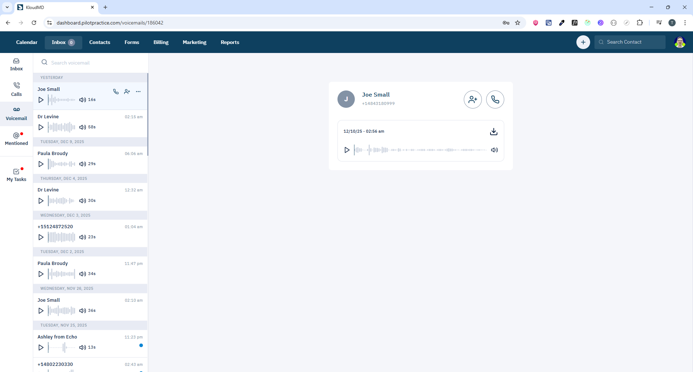

# Voicemails Screen - Quản lý thư thoại

## 1. Giới thiệu
Màn hình Voicemails hiển thị tất cả các cuộc gọi có status `voicemail` - khi caller để lại tin nhắn thoại.

**Routes:**
- `/voicemails` - Danh sách tất cả voicemails
- `/voicemails/:id` - Chi tiết voicemail cụ thể

**Scope:** Xem, nghe, đánh dấu đã nghe, xóa voicemails.

---

## 2. Yêu cầu chức năng

### 2.1 Hiển thị Voicemails
- Danh sách voicemails (calls với `status === 'voicemail'`)
- Thông tin hiển thị:
  - From phone number
  - Lead information
  - Duration
  - Recording URL
  - Timestamp
  - Listened status
- Pagination
- Search theo keyword (phone number, lead name)

### 2.2 Chi tiết Voicemail
- Play voicemail recording
- Lead details sidebar
- Messages history với lead
- Transcription (nếu có)
- Mark as listened/unlistened
- Delete voicemail

### 2.3 Actions
- Play/Pause recording
- Download recording
- Mark as listened
- Delete voicemail
- Call back lead
- Create ticket from voicemail

---

## 3. API Endpoints

| Method | Endpoint | Mục đích | Params | Response |
|--------|----------|----------|--------|----------|
| GET | `/api/calls` | Lấy danh sách voicemails | `page`, `keyword?`, `get_voicemail=true` | `CommonPagination<Call>` |
| GET | `/api/calls/:id` | Lấy chi tiết voicemail | `id` | `Call` |
| PUT | `/api/calls/:id` | Mark as listened | `id`, `listened: true` | `Call` |
| DELETE | `/api/calls/:id` | Xóa voicemail | `id` | `Call` |

### 3.1 Get Voicemails Params
```typescript
{
  page: number;
  keyword?: string;
  get_voicemail: true;    // Required để filter voicemails
}
```

### 3.2 Mark as Listened
```typescript
PUT /api/calls/:id
{
  listened: true
}
```

---

## 4. WebSocket Events

| Event Type | Trigger | Action |
|------------|---------|--------|
| `NEW_VOICEMAIL` | Voicemail mới | Invalidate `['getDataVoicemail']`, show notification |
| `VOICEMAIL_UPDATED` | Voicemail được cập nhật | Invalidate `['getDataVoicemail']`, refresh UI |

---

## 5. Redux State

### 5.1 Call State (Shared với Calls)
- `call.callPage` - Current page number

---

## 6. Lưu ý kỹ thuật

### 6.1 Filter Logic
- **Voicemail filter:** `get_voicemail=true` trong API params
- Backend filter calls có `status === 'voicemail'`

### 6.2 Recording Playback
- Use HTML5 `<audio>` element
- Support play/pause/seek
- Display duration và current time
- Auto-mark as listened khi play recording

### 6.3 Notification
- Browser notification khi có voicemail mới
- Badge count trên sidebar menu
- Sound alert (optional)

---

## 7. Component Structure

```
pages/apps/voicemails.tsx
└── containers/apps/
    ├── ticket/sidebar/       # Sidebar với isVoicemail flag
    ├── calls/group/          # Voicemail list (reuse từ calls)
    └── voicemails/main/      # Voicemail detail
```

---

## 8. Permissions
- **All roles:** Có thể xem và nghe voicemails
- **Staff:** Chỉ xem voicemails của leads được assign
- **Admin/Owner:** Xem tất cả voicemails

---

