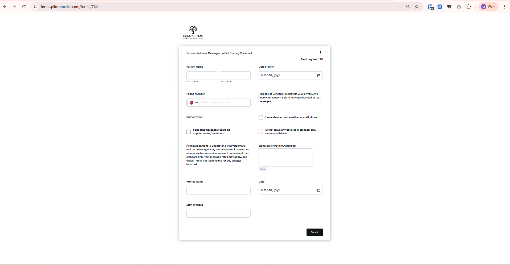
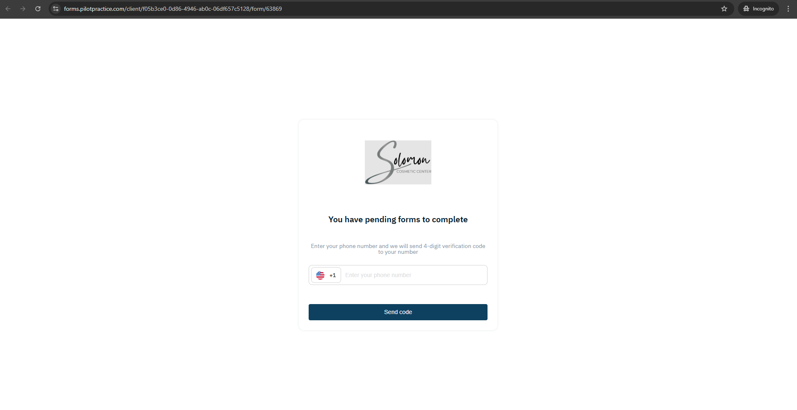

# Online Forms Widget - Documentation

## 1. Giới thiệu
Online Forms Widget là một ứng dụng React cho phép người dùng điền và submit các form trực tuyến. Widget hỗ trợ nhiều loại field khác nhau, authentication, signature, file upload và multi-page forms.

**Routes:**
- `/forms/:template` - Form template công khai
- `/client/:projectUUID/form/:form` - Form của lead cụ thể (yêu cầu authentication)

**Scope:** Điền form, upload file, signature, OTP authentication, multi-page navigation, download PDF.

---

## 2. Yêu cầu chức năng

### 2.1 Hiển thị Form
- Render form với nhiều pages
- Hiển thị custom fields theo type
- Validation 
- Progress tracking (page hiện tại / tổng số pages)
- Responsive design (desktop, mobile, iframe)



### 2.2 Field Types

Widget hỗ trợ các loại field sau:

- **TEXT_FIELD** (`textarea`) - Text area
- **DATE** (`date`) - Date picker
- **SINGLE_CHECKBOX** (`checkbox`) - Single checkbox
- **MULTIPLE_CHOICE** (`radio`) - Radio buttons (single select)
- **MULTI_SELECT** (`multi_select`) - Checkboxes (multiple select)
- **DROPDOWN** (`dropdown`) - Dropdown select
- **YES_OR_NO** (`yes_or_no`) - Yes/No radio buttons
- **INITIALS** (`initials`) - Signature canvas (initials)
- **SIGNATURE** (`signature`) - Signature canvas (full signature)
- **PHONE_NUMBER** (`phonenumber`) - Phone input với validation
- **EMAIL_ADDRESS** (`emailaddress`) - Email input với validation
- **ADDRESS** (`address`) - Address fields (street, city, state, zip, line2)
- **TEXT** (`text`) - Static text/description
- **FULL_NAME** (`fullname`) - First name + Last name
- **UPLOAD_FILE** (`upload_file`) - File upload

### 2.3 Authentication
- **Phone OTP Authentication:**
  - Nhập số điện thoại
  - Gửi OTP code qua SMS (Twilio)
  - Verify OTP code (6 digits)
  - Login vào portal client
- **Signatory Authentication:**
  - Form có signatories (multiple signers)
  - Verify signature link với lead_id + signature token



### 2.4 Form Submission
- Submit từng page (auto-save responses)
- Submit toàn bộ form (final submission)
- Upload files với multipart/form-data
- Validation theo field requirements
- Error handling và display

### 2.5 Download PDF
- Download form đã hoàn thành dưới dạng PDF
- Base64 encoded content
- Multiple files support

---

## 3. API Endpoints

| Method | Endpoint | Mục đích | Params | Response |
|--------|----------|----------|--------|----------|
| GET | `/sanctum/csrf-cookie` | Lấy CSRF token | - | `AxiosResponse` |
| GET | `/api/template/:id/details` | Lấy form template | `form_id` | `Form` |
| GET | `/portal/forms/:form` | Lấy form của lead | `form` | `Form` |
| PUT | `/portal/forms/:id/sign` | Submit form (deprecated) | `form_id`, `data[]` | `Form` |
| POST | `/api/template/:id/submitting` | Submit form template | `FormData` | `Form` |
| PUT | `/api/forms/:form/page/:page/response` | Update page response | `form`, `page`, `custom_fields` | `Form` |
| POST | `/api/forms/:formId/page/:pageId/upload-file` | Upload file to field | `formId`, `pageId`, `FormData` | `Form` |
| GET | `/api/printPdf/form/:id` | Download form PDF | `id` | `FormViewPdf[]` |
| GET | `/api/template/:id/download` | Download template | `id` | `DownloadFile[]` |
| POST | `/api/twilio/verification/token` | Gửi OTP code | `phone` | `AxiosResponse` |
| POST | `/portal/project/:project/login/phone/:phone` | Login với OTP | `phone`, `code`, `project` | `Lead` |
| GET | `/portal/client/info` | Lấy thông tin lead | - | `Lead` |
| POST | `/portal/lead/sign/:lead_id` | Sign form với signature token | `lead_id`, `signature` | `Form` |
| GET | `/api/projects/info` | Lấy project info | `project_uuid` | `ResponseInfo` |
| POST | `/api/forms/form-batch/lead/:lead_id` | Send form preview | `lead_id`, `due_date`, `template_ids` | `Form[]` |
| POST | `/api/forms/form-batch/:id/send` | Send form batch | `formBatch`, `message`, `subject`, `cc` | `void` |

### 3.1 Form Structure
```typescript
interface Form {
  id: number;
  project_id: number;
  lead_id: number;
  status: string;                    // "pending" | "complete"
  signing_status: string;
  due_date?: number;
  event_id?: number;
  staff_id?: number;
  completed_at?: number;
  form_batch_id: number;
  template_id?: number;
  name?: string;
  type?: string;
  file: File;
  signatories?: Signatory[];
  pending_lead_signature: boolean;
  pending_staff_signature: boolean;
  pages: TemplatePages[];
  project_logo?: string;
  current_signer?: Signatories;
  require_authentication?: boolean;  // Yêu cầu OTP authentication
}
```

### 3.2 TemplatePages Structure
```typescript
interface TemplatePages {
  id: number;
  order: number;
  template_id: number;
  custom_fields: CustomField[];
  custom_field_responses: CustomFieldResponse[];
  file: {
    mime_type: string;
    contents: string;               // Base64 background image
  };
  width: number;
  height: number;
  height_of_text?: number;
  parent_page?: number;
  title?: string;
  description?: string;
}
```

### 3.3 CustomField Structure
```typescript
interface CustomField {
  id: number;
  model_id: number;                 // Page ID
  model: TemplatePages;
  type: string;                     // Field type constant
  title: string;
  description: string;
  placeholder?: string;
  default_value: string;
  position_x: number;               // Position on page
  position_y: number;
  width: number;
  height: number;
  order: number;
  required?: boolean;
  is_disabled?: boolean;
  available_date?: string;
  color?: string;
  name?: string;
  answers: string | string[] | { id?: number; answer?: string }[];
  value?: string;                   // Current value
  signatory?: {
    signable_id?: number;
    signable_type: string;
  };
}
```

### 3.4 UpdateFormResponseParams
```typescript
type UpdateFormResponseParams = {
  form: number;                     // Form ID
  page: number;                     // Page ID
  custom_fields?: {
    [key: number]: string | number; // Field ID: Value
  };
}
```

### 3.5 ClientLogin
```typescript
type ClientLogin = {
  phone: string;                    // Phone number
  code: string;                     // OTP code (6 digits)
  project: number;                  // Project ID
}
```

---

## 4. Redux State Management

### 4.1 State Structure
```typescript
interface StateForm {
  form: Form | null;                // Current form data
  arrayField: CustomField[];        // Merged fields from all pages
  valueCustomField: {               // Current field values
    [key: string]: string | { [key: string]: string };
  };
  errorCustomField: {               // Field validation errors
    [key: string]: string;
  };
  visitor: number | null;           // Visitor ID
  lead: null;                       // Lead data (after authentication)
}
```

### 4.2 Actions
- `SET_FORM_DETAILS` - Set form data và merge fields
- `SET_LEAD` - Set lead data sau authentication
- `CLEAR` - Clear toàn bộ state

### 4.3 Action Creators
```typescript
setFormDetails(payload: Form)      // Dispatch SET_FORM_DETAILS
setLead(payload: Lead)             // Dispatch SET_LEAD
clear()                            // Dispatch CLEAR
```

---

## 5. Component Structure
```
src/
├── App.tsx                        # Main app với routing
├── pages/
│   ├── home/
│   │   ├── Home.tsx              # Template form page
│   │   └── form-authentication/
│   │       ├── index.tsx         # Authentication wrapper
│   │       └── NewLeadPublic.tsx # OTP authentication form
│   ├── lead/
│   │   └── FormLead.tsx          # Lead form page (với authentication)
│   └── complete/
│       └── index.tsx             # Form completion page
├── components/
│   ├── form/
│   │   └── index.tsx             # Main form component
│   ├── field/
│   │   ├── index.tsx             # Field renderer
│   │   ├── input/                # Text, date, radio, checkbox inputs
│   │   ├── dropdown/             # Dropdown select
│   │   ├── signature/            # Signature canvas
│   │   ├── phone/                # Phone input
│   │   ├── email/                # Email input
│   │   ├── address/              # Address fields
│   │   ├── name/                 # Full name fields
│   │   └── upload-file/          # File upload
│   ├── page/                     # Page wrapper component
│   ├── button/                   # Button component
│   ├── modal/                    # Modal component
│   ├── loading/                  # Loading spinner
│   └── spinner/                  # Spinner component
├── api/
│   └── form/
│       ├── index.tsx             # Form API calls
│       └── lead/
│           └── index.ts          # Lead API calls
├── hooks/
│   ├── useFillResponsesField.ts  # Auto-save field responses
│   ├── useUploadFileField.ts     # Upload file to field
│   ├── useSignLeadForm.tsx       # Sign form với signature token
│   └── useClickOutside.tsx       # Click outside detector
├── store/
│   ├── Context.ts                # React Context
│   ├── Provider.tsx              # Context Provider
│   ├── reducer.ts                # State reducer
│   ├── action.ts                 # Action creators
│   ├── constants.ts              # Field type constants
│   └── hooks.ts                  # useStore hook
├── types/
│   └── form.ts                   # TypeScript types
├── helpers/
│   ├── mergeFields.ts            # Merge fields from pages
│   ├── formatHidden.ts           # Format hidden phone
│   └── convertBast64ToPdfDownload.ts # Convert base64 to PDF
└── utils/
    ├── request.ts                # Axios instance
    ├── params.ts                 # URL params helper
    ├── checkEmpty.ts             # Check empty object
    └── toUrlProjectLogo.ts       # Convert logo URL
```

---

## 6. Lưu ý kỹ thuật

### 6.1 Form Validation
- Sử dụng `react-hook-form` + `yup` schema validation
- Generate dynamic validation schema theo field requirements
- Validate theo field type:
  ```typescript
  // Required field
  if (field.required) {
    schema = yup.string().required("This field is required");
  }
  
  // Email validation
  if (field.type === EMAIL_ADDRESS) {
    schema = yup.string().email("Invalid email");
  }
  
  // Phone validation
  if (field.type === PHONE_NUMBER) {
    schema = yup.string().matches(/^\+?[1-9]\d{1,14}$/, "Invalid phone");
  }
  
  // Address validation (all sub-fields required)
  if (field.type === ADDRESS && field.required) {
    schema = yup.object().shape({
      streetaddress: yup.string().required(),
      city: yup.string().required(),
      stateprovince: yup.string().required(),
      postalzipcode: yup.string().required(),
    });
  }
  ```

### 6.2 Auto-save Responses
- Sử dụng `useFillResponsesField` hook
- Tự động save khi user blur khỏi field
- Debounce để tránh spam API
- Clear validation error sau khi save thành công

### 6.3 File Upload
- Sử dụng `useUploadFileField` hook
- Upload ngay khi user chọn file
- FormData với multipart/form-data
- Support multiple file types
- Validation file size và type

### 6.4 Signature Canvas
- Sử dụng `react-signature-canvas`
- Convert signature to base64 image
- Support INITIALS và SIGNATURE types
- Clear và redraw functionality

### 6.5 Phone Number Validation
- Sử dụng `libphonenumber-js`
- Validate international phone numbers
- Format phone number display
- Country code support

### 6.6 Multi-page Navigation
- Track current page index
- Previous/Next buttons
- Submit page responses trước khi navigate
- Scroll to top khi change page
- Progress indicator

### 6.7 Iframe Support
- Detect iframe mode: `window.self !== window.top`
- Detect iframe-modal param: `?iframe-modal=true`
- Adjust styling cho iframe
- Post message to parent window khi complete

### 6.8 Authentication Flow
**Phone OTP:**
1. User nhập phone number
2. Click "Send Code" → `POST /api/twilio/verification/token`
3. Nhập 6-digit OTP code
4. Click "Verify" → `POST /portal/project/:project/login/phone/:phone`
5. Set lead data → `SET_LEAD` action
6. Redirect to form

**Signatory:**
1. URL có `lead_id` và `signature` params
2. Auto call `POST /portal/lead/sign/:lead_id?signature=xxx`
3. Verify signature token
4. Load form data
5. Show form for signing

### 6.9 Form Submission Flow
**Template Form:**
1. User điền fields
2. Auto-save responses (blur event)
3. Click "Next" → Validate page → Submit page
4. Repeat cho tất cả pages
5. Last page → Click "Submit" → `POST /api/template/:id/submitting`
6. Convert to FormData (support file upload)
7. Redirect to completion page

**Lead Form:**
1. Authenticate first (OTP hoặc signature)
2. Load form: `GET /portal/forms/:form`
3. User điền fields
4. Auto-save: `PUT /api/forms/:form/page/:page/response`
5. Upload files: `POST /api/forms/:formId/page/:pageId/upload-file`
6. Submit: `POST /api/template/:id/submitting`

### 6.10 Download PDF
- Click download button
- `GET /api/printPdf/form/:id`
- Receive base64 encoded PDF
- Convert base64 to Blob
- Create download link
- Auto download file

### 6.11 Error Handling
```typescript
// API Error
interface IError {
  data: {
    message: string;
  };
  status?: number;
}

// Display error
onError: (error: IError) => {
  toast.error(error?.data?.message || "Something went wrong");
}
```

### 6.12 React Query Configuration
```typescript
// Fetch form details
useQuery(
  ["fetchFormDetails", template],
  () => getFormApi({ form_id: Number(template) }),
  {
    onSuccess(data) {
      dispatch(setFormDetails(data));
    },
    refetchOnWindowFocus: false,
    keepPreviousData: true,
  }
);

// Submit form
useMutation(submittingTemplate, {
  onSuccess(data) {
    // Handle success
  },
  onError(error) {
    // Handle error
  }
});
```

---

## 7. Field Rendering Logic

### 7.1 Field Component
```typescript
const Field: FC<FieldProps> = ({ field }) => {
  const renderCustomField = (field: CustomField) => {
    switch (field.type) {
      case TEXT_FIELD:
      case DATE:
      case YES_OR_NO:
      case SINGLE_CHECKBOX:
      case MULTIPLE_CHOICE:
      case MULTI_SELECT:
        return <Input field={field} type={field.type} />;
      case DROPDOWN:
        return <Dropdown field={field} />;
      case INITIALS:
      case SIGNATURE:
        return <Signature field={field} />;
      case PHONE_NUMBER:
        return <Phone field={field} />;
      case ADDRESS:
        return <AddressField field={field} />;
      case EMAIL_ADDRESS:
        return <Email field={field} />;
      case TEXT:
        return <p>{field.answers}</p>;
      case FULL_NAME:
        return <FullName field={field} />;
      case UPLOAD_FILE:
        return <UploadFile field={field} />;
      default:
        return null;
    }
  };
  return <div className="field">{renderCustomField(field)}</div>;
};
```

### 7.2 Input Component Logic
- TEXT_FIELD → `<textarea>`
- DATE → `<DatePicker>` (react-datepicker)
- YES_OR_NO → Radio buttons (Yes/No)
- SINGLE_CHECKBOX → `<input type="checkbox">`
- MULTIPLE_CHOICE → Radio buttons group
- MULTI_SELECT → Checkboxes group

### 7.3 Address Component
```typescript
// Address fields
const ADDRESS_FIELDS = [
  "streetaddress",
  "city", 
  "stateprovince",
  "postalzipcode",
  "streetaddressline2"
];

// Value structure
{
  streetaddress: string;
  city: string;
  stateprovince: string;
  postalzipcode: string;
  streetaddressline2?: string;
}
```

### 7.4 Full Name Component
```typescript
// Name fields
const FULLNAME_FIELDS = ["firstname", "lastname"];

// Value structure
{
  firstname: string;
  lastname: string;
}
```

---

## 8. Styling & Responsive

### 8.1 Styled Components
- Sử dụng `styled-components` cho styling
- Theme support
- Responsive breakpoints
- Dynamic props

### 8.2 Iframe Styling
```typescript
<StyledWrap
  $isInSideIframe={isInSideIframe}
  $isIframeModal={!!isIframeModal}
  $loading={isLoading}
  $isFormComplete={state?.form?.status === "complete"}
>
```

### 8.3 Page Background
- Render background image từ `page.file.contents` (base64)
- Position fields absolute theo `position_x`, `position_y`
- Scale theo page width/height

---

## 9. Dependencies

### 9.1 Core
- `react` ^18.2.0
- `react-dom` ^18.2.0
- `react-router-dom` ^6.16.0
- `typescript` ^5.0.2

### 9.2 State Management
- `react-query` ^3.39.3 - Data fetching & caching

### 9.3 Forms
- `react-hook-form` ^7.47.0 - Form handling
- `@hookform/resolvers` ^3.3.2 - Validation resolvers
- `yup` ^1.3.2 - Schema validation

### 9.4 UI Components
- `styled-components` ^6.0.8 - CSS-in-JS
- `react-datepicker` ^4.21.0 - Date picker
- `react-signature-canvas` ^1.0.6 - Signature canvas
- `react-helmet-async` ^2.0.5 - Document head management

### 9.5 Utilities
- `axios` ^1.5.0 - HTTP client
- `lodash` ^4.17.21 - Utility functions
- `moment` ^2.29.4 - Date formatting
- `libphonenumber-js` ^1.10.44 - Phone validation
- `clsx` ^2.0.0 - Class name utility

---

## 10. Environment Variables

```env
VITE_API_URL=https://api.example.com
VITE_PROJECT_ID=123
```

---

## 11. Build & Deploy

### 11.1 Development
```bash
npm run dev
```
---

## 12. Common Issues & Solutions

### 12.1 CSRF Token Missing
**Problem:** API calls fail với 419 error
**Solution:** Ensure `getCSRFToken()` được gọi trong `App.tsx`

### 12.2 Validation Not Working
**Problem:** Form submit mặc dù có lỗi
**Solution:** Check `generateFieldValidationSchema` logic

### 12.3 Auto-save Not Triggering
**Problem:** Field values không được save
**Solution:** Check `useFillResponsesField` hook và blur event

### 12.4 Signature Canvas Blank
**Problem:** Signature không hiển thị
**Solution:** Check canvas size và `react-signature-canvas` props

### 12.5 Phone Validation Fails
**Problem:** Valid phone bị reject
**Solution:** Check `libphonenumber-js` format và country code

### 12.6 Iframe Not Displaying
**Problem:** Form không hiển thị trong iframe
**Solution:** Check `$isInSideIframe` prop và styling

---

## 13. API Response Examples

### 13.1 Get Form Template
```json
{
  "id": 123,
  "name": "Patient Intake Form",
  "status": "pending",
  "pages": [
    {
      "id": 1,
      "order": 1,
      "title": "Personal Information",
      "custom_fields": [
        {
          "id": 1,
          "type": "fullname",
          "title": "Full Name",
          "required": true,
          "answers": []
        }
      ]
    }
  ]
}
```

### 15.2 Submit Form Response
```json
{
  "id": 123,
  "status": "complete",
  "completed_at": 1638360000,
  "pages": [...]
}
```

---
