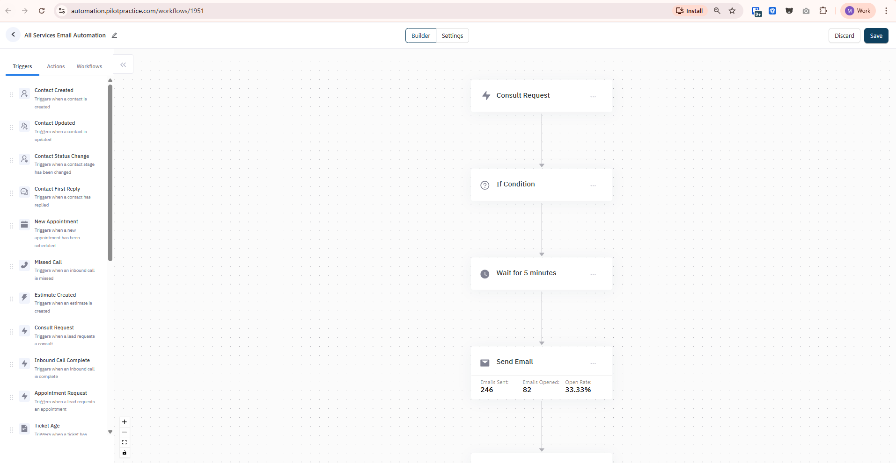

# Workflow Builder - Quản lý workflow tự động

## 1. Giới thiệu
Ứng dụng Workflow Builder cho phép tạo và quản lý các workflow tự động hóa với giao diện kéo-thả (drag & drop) sử dụng ReactFlow.

**Routes:**
- `/` - Workflow builder canvas

**Scope:** Tạo workflow, cấu hình triggers, actions, conditions, quản lý settings, xem metrics.



---

## 2. Yêu cầu chức năng

### 2.1 Workflow Builder
- Canvas kéo-thả nodes (triggers, actions, conditions)
- Kết nối nodes với edges
- Xóa nodes và branches
- Chỉnh sửa label của nodes
- Toggle action dropdown cho mỗi node
- Auto-layout và smooth step connections

### 2.2 Triggers
- Load danh sách triggers từ API
- Hiển thị triggers trong sidebar
- Kéo trigger vào canvas để bắt đầu workflow

### 2.3 Actions & Conditions
- Blocks: các action blocks (send email, delay, etc.)
- Condition Editor: tạo điều kiện logic
- Template tags: dynamic fields cho email/SMS

### 2.4 Settings
- Business hours configuration
- Excluded workflows
- Workflow metadata (name, description, status)

### 2.5 Metrics
- Xem metrics của workflow hiện tại
- So sánh metrics giữa các versions

---

## 3. API Endpoints

| Method | Endpoint | Mục đích | Response |
|--------|----------|----------|----------|
| GET | `/api/workflow/triggers` | Lấy danh sách triggers | `Trigger[]` |
| GET | `/api/workflows` | Lấy danh sách workflows | `CommonPagination<IWorkflowResponse>` |
| GET | `/api/workflows/:id` | Lấy chi tiết workflow | `IWorkflowResponse` |
| POST | `/api/workflows` | Tạo workflow mới | `IWorkflowResponse` |
| PUT | `/api/workflows/:id` | Cập nhật workflow | `IWorkflowResponse` |
| GET | `/api/workflow/condition-field/:id/values` | Lấy values cho condition field | `TConditionFieldValueResponse` |

### 3.1 IWorkflowResponse
```typescript
{
  id?: number;
  name: string;
  description?: string;
  status: "active" | "inactive" | "draft";
  nodes: Node[];              // ReactFlow nodes
  edges: Edge[];              // ReactFlow edges
  settings: IWorkflowSettings;
  metrics?: IMetric[];
  createdAt?: Date;
  updatedAt?: Date;
}
```

### 3.2 Trigger
```typescript
{
  id: number;
  name: string;
  type: string;               // trigger type
  conditionFields: any;
  description: string;
  triggerable: string;
}
```

---

## 4. Zustand Store

### 4.1 Main Store (stores/index.ts)
- `nodes: Node[]` - ReactFlow nodes
- `edges: Edge[]` - ReactFlow edges
- `blocks: IBlock[]` - Available blocks/actions
- `conditionFields: TConditionFields` - Condition field definitions
- `settings: IWorkflowSettings` - Workflow settings
- `currentMetrics: IMetric[]` - Current workflow metrics
- `currentTab: string` - Active tab (builder/settings/metrics)

### 4.2 Actions
- `setNodes()` - Set nodes
- `setEdges()` - Set edges
- `onNodesChange()` - Handle node changes
- `onEdgesChange()` - Handle edge changes
- `onConnect()` - Connect nodes
- `deleteNode()` - Xóa node và downstream nodes
- `deleteBranchNode()` - Xóa branch cụ thể
- `toggleNodeActionDropdown()` - Toggle dropdown
- `onChangeNodeLabel()` - Đổi label
- `updateWorkflowSettings()` - Cập nhật settings

### 4.3 Condition Editor Store
- Quản lý state riêng cho Condition Editor
- Handle complex condition logic

---

## 5. Component Structure

```
src/
├── pages/
│   └── index.tsx              # Main workflow page
├── components/
│   ├── Workflow/              # Main workflow canvas
│   ├── Sidebar/               # Blocks sidebar
│   ├── NavigationBar/         # Top navigation
│   ├── KloudMDNodes/          # Custom node types
│   ├── KloudMDEdges/          # Custom edge types
│   ├── NodeSettingsPanel/     # Node configuration panel
│   ├── ConditionEditor/       # Condition builder
│   ├── WorkflowSettings/      # Workflow settings
│   ├── TinyMCEEditor/         # Rich text editor
│   └── TemplateTagDropdown/   # Dynamic tags
├── stores/
│   ├── index.ts               # Main Zustand store
│   └── useConditionEditorStore.ts
├── apis/
│   ├── workflow.ts            # Workflow API
│   ├── template.ts            # Template API
│   ├── staff.ts               # Staff API
│   └── files.ts               # File upload API
├── types/                     # TypeScript types
└── utils/
    └── graphs.ts              # Graph utilities
```

---

## 6. Lưu ý kỹ thuật

### 6.1 ReactFlow Integration
- Sử dụng `reactflow` library
- Custom node types: trigger, action, condition, delay
- Custom edge types: smooth step connections
- Auto-layout với `d3-hierarchy`

### 6.2 State Management
- Zustand cho global state
- React Query cho API calls
- Shallow comparison để optimize re-renders

### 6.3 Node Operations
```typescript
// Delete node và tất cả downstream nodes
deleteNode(nodeId);

// Delete specific branch
deleteBranchNode(nodeId, branches);

// Connect nodes
onConnect({ source, target, sourceHandle, targetHandle });
```

### 6.4 Condition Editor
- Nested conditions với AND/OR logic
- Dynamic field values từ API
- Support operators: equals, contains, greater than, etc.

### 6.5 Template Tags
- Dynamic fields: `{{lead.name}}`, `{{lead.email}}`
- Sử dụng trong email/SMS templates
- TinyMCE integration cho rich text

---

## 7. Dependencies

**Core:**
- `react` ^18.2.0
- `react-router-dom` ^6.11.2
- `typescript` ^4.9.5

**State & Data:**
- `zustand` ^4.3.7
- `@tanstack/react-query` ^4.29.12
- `axios` ^1.4.0

**UI & Workflow:**
- `reactflow` ^11.7.0
- `antd` ^5.4.5
- `styled-components` ^5.3.10
- `framer-motion` ^10.12.7
- `@tinymce/tinymce-react` ^4.3.0

**Utilities:**
- `lodash-es` ^4.17.21
- `immer` ^10.0.2
- `yup` ^1.2.0
- `d3-hierarchy` ^3.1.2

---

## 8. Workflow Flow

### 8.1 Tạo Workflow Mới
1. User kéo trigger từ sidebar vào canvas
2. Thêm actions/conditions từ blocks
3. Kết nối nodes với edges
4. Cấu hình settings cho từng node
5. Set workflow settings (business hours, etc.)
6. Save workflow → `POST /api/workflows`

### 8.2 Edit Workflow
1. Load workflow → `GET /api/workflows/:id`
2. Populate nodes và edges vào canvas
3. User chỉnh sửa
4. Save changes → `PUT /api/workflows/:id`

### 8.3 View Metrics
1. Switch tab sang "metrics"
2. Load metrics → từ workflow response
3. Hiển thị charts và statistics

---

## 9. Environment Variables

```bash
REACT_APP_API_URL=          # Backend API URL
REACT_APP_TINYMCE_KEY=      # TinyMCE API key
```

---

## 10. Scripts

```bash
npm start           # Dev server (localhost:3000)
npm run build       # Production build
npm test            # Run tests
npm run lint        # ESLint check
```

---
